# minkycolor
Fun facts:

1. There are evidently ZERO pictures of minky on the internet that are both:
    1. High quality
    2. Color calibrated
2. ... and an annoying number that are neither, along with being practically unlabeled.
3. I'm angry about color mangament and you should be too.

For what this is worth, I don't really know what I'm doing. I have a swatch set, a decent camera in my phone that can take RAW images, a copy of Lightroom, a color calibration card and the appropriate software to use said calibration card. What are my qualifications for doing this? Absolutely nothing other than owning those things and point 3 above.

Why am I doing this? Because I Can And I'm Mad About Minky Colors. Also I'd like plushes I order to be the right color.

The swatch set is from [Howl Fabrics](https://www.howlfabrics.com). #notsponsored and R.I.P. fabric.com

Words of caution:

## Color management is a complete pain in the crotch.

What you see on your monitor or phone or whatever is an approximation of what things actually look like. I've done the best I know to get the pictures I took to be accurate, but if your display is not appropriately calibrated - and odds are it isn't - then this won't be true to life.

That being said, in theory if you're looking at these images and trying to match one to a reference image on the same display, they'll be close.

To get a better idea of what a given color will look like when you have it in front of you, comparing these pictues against bits of minky you have and can look at may help but this will only go so far.

## The actual fabric can be hilariously inconsistent between batches

There are reports of a specific color of minky having wildly varying colors over time as the factory produces additional batches. If you've ever looked at Shannon's website, or really any of the sites for places that sell minky, you'll know that they just take a random picture and call it good enough, which implies volumes about how much they care about color consistency.

What I'm saying is don't take these pictures as the absolute hard truth. Your Mileage May Vary.

# Methodology

These pictures were taken using a Pixel 6 under 5000K lighting with the lights about 30 degrees above the camera. All of the processed pictures have been adjusted in Lightroom using the [procedure suggested by the color calibration card's manufacturer](https://spyderx.datacolor.com/wp-content/uploads/2020/03/Spyder-Checkr-24-UserGuide.pdf)(page 10). The calibration file is included in the repo, though it does not include the changes to white balance, exposure and curves to meet the process.

```
                             Light


                 Camera
Target           
```

Each swatch of minky has the left side brushed down with the nap of the fabric and the right side brushed against the nap of the fabric with the edge of a credit card to stand the fibers up on end. The nap is always towards the bottom of the piece of paper. Some swatches may not be fully brushed on both sides, but the bulk of either side has been brushed.

Each image has an inverted version, where the whole swatch card is flipped upside down. This is important because the way the light strikes the minky vs the way it's been brushed can wildly change the way it appears. These are presented as the pictures were taken, so left/right need to be swapped for minky brushing. More combinations of light angle vs viewing angle may need to be captured because this can influence the perception quite a bit.

# Cram It I Need Pictures Of Fabric!

Many colors are poorly represented in minky. You should look at ALL of swatch cards because there are some pretty subjective crossovers.

* An orangeish character ended up having a better match on the Pinks card because Papaya is evidently pink???
* A dull blue character ended up being somewhere between Midnight Blue (Blues card) and Malliard (Greens card) and which one was "correct" is both subjective and depends on the colors picked for other features.

## Blues

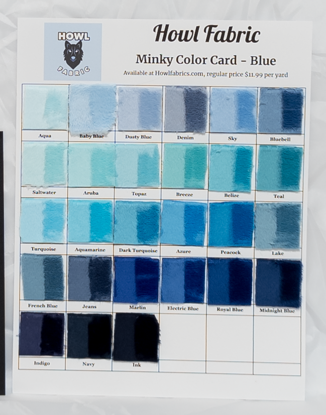 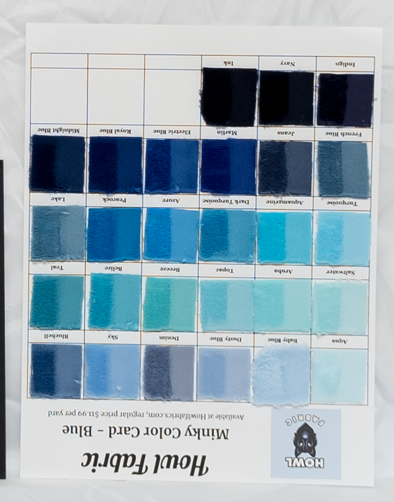

## Grays

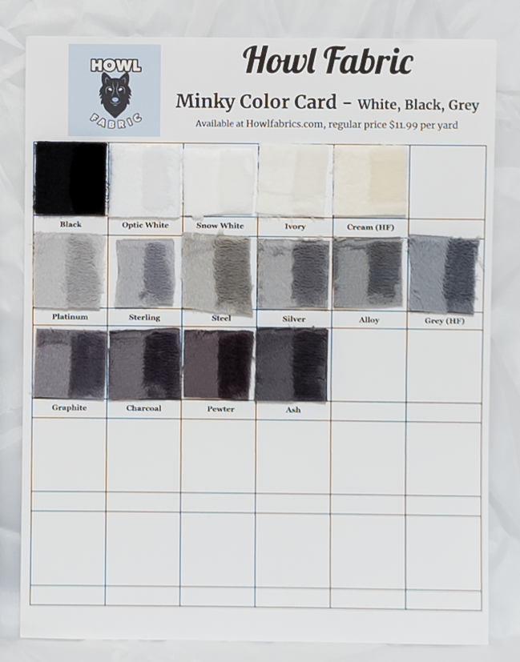 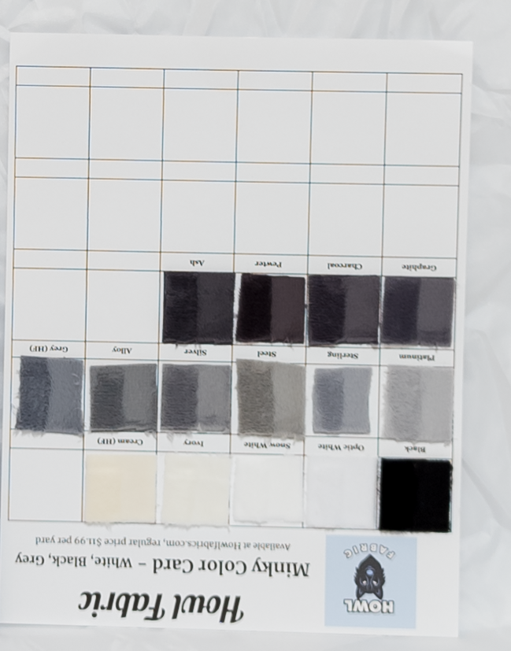

## Greens

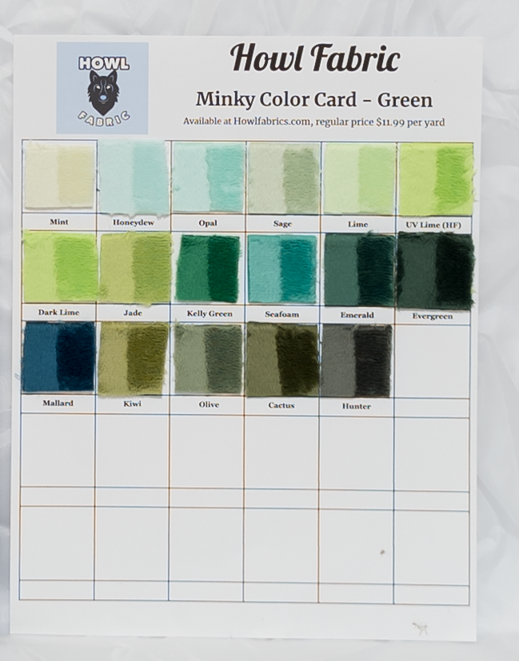 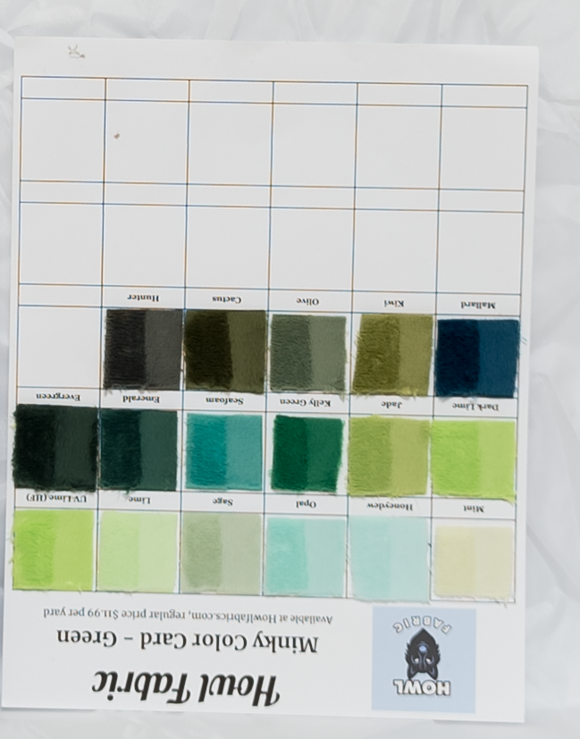

## Pinks

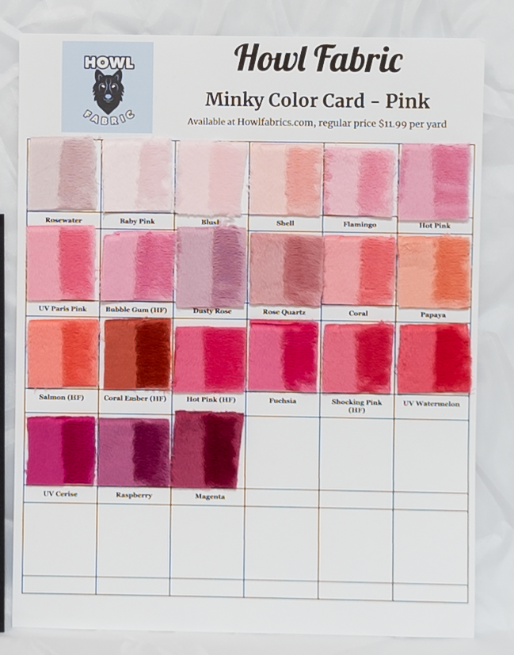 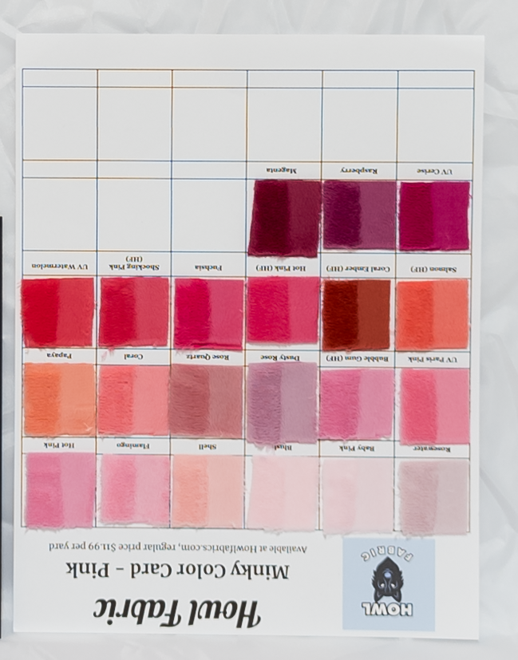

## Reds and Purples

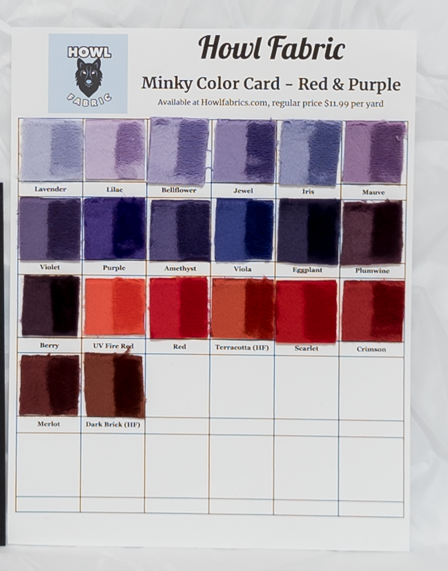 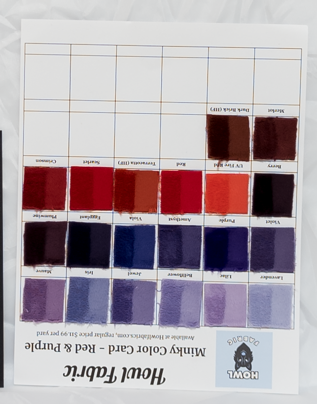

## Tans and Browns

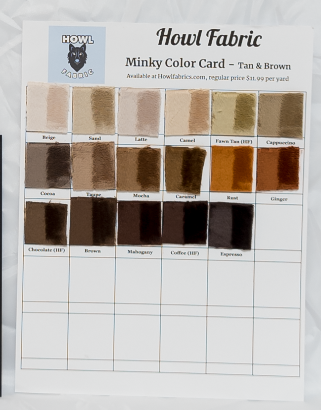 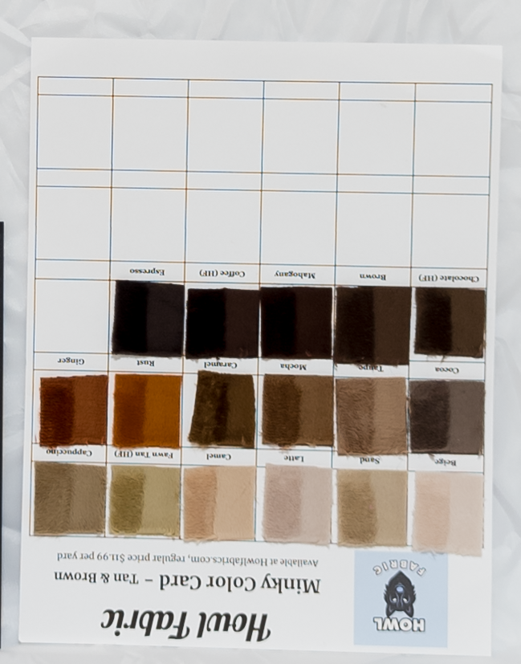

## Yellows and Oranges

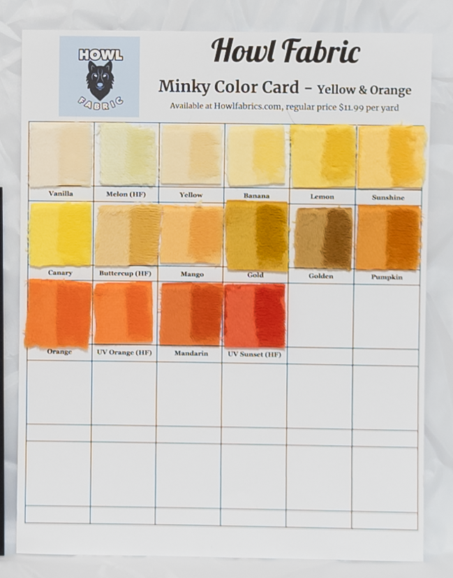 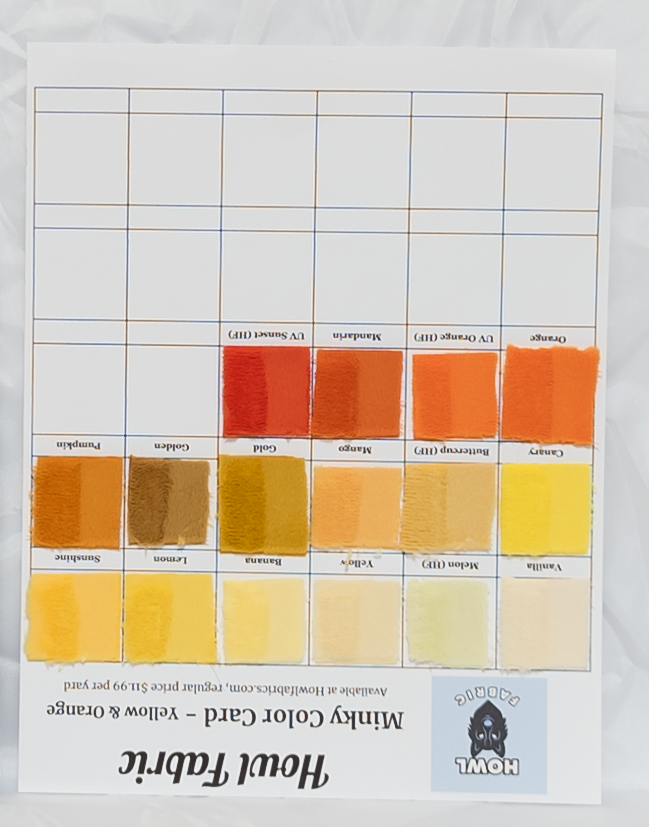

# You messed this up because _______!

Neat. Help me learn by making an issue on Github, or better yet sending a pull request with a description of why things need changed to correct whatever I did wrong.

The raw images with the Datacolor SpyderCHECKR 24 calibration card are available in the repo, if you have better tools than I do or know what you're doing better than I do, and want to reprocess them.
